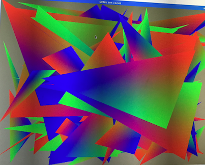
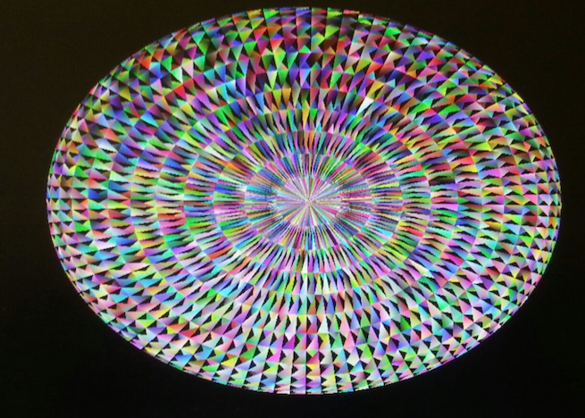

# Project Title
DEVICE DRIVER IMPLEMENTATION

Implemented device driver for the Kyouko3 PCIe graphics card.  The device driver is built as a kernel module and is structured so that the card appears as a character device (major 500, minor 127) accessible through system calls open(), close(), mmap() and ioctl(). The driver will deliver sufficient capability to the user level to enable the user to draw smooth-shaded triangles.

## Description
Enabled drawing of single triangles directly, through the FIFO facility, using memorymapped control registers, where the memory-mapping is invoked by a user-level system call to mmap()

Enabled drawing of large numbers of triangles indirectly, through the DMA facility, using driver-allocated DMA buffers that have been memory-mapped to user space

## Build
Make, insert module and compile the user program
./reinstall.sh

## Run the user code
./a.out
